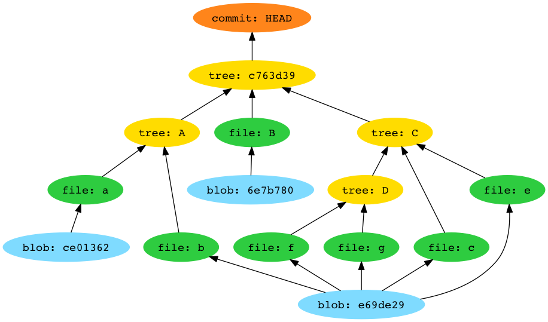

git-little-picture
##################

Introspect your repository by drawing a DAG of the tree object behind a commit.
The graph shows the mapping of tree names to blob names to content hashes. This
is useful for looking at how Git handles deduplication, but not much else.

Prerequisites
=============
Some "proper software" is needed before you can use ``git-little-picture``:

    - libgit2
    - graphviz

On OSX with Homebrew, it's as simple as::

    brew install libgit2 graphviz

Installation
============
There isn't any per-se. Just clone the repo and install the requirements.
Commands provided assume you're in a virtual environment::

    cd
    git clone https://github.com/bmcorser/git-little-picture.git
    cd git-litte-picture
    pip install -r requirements.txt

Usage
=====
There is a single command line script provided, ``glp.py``.

There is one required argument: the path to a git repository

There is one optional argument: a ref (default ``HEAD``)

Output is ``<ref>.svg``, which is an SVG of the graph, with the same name as
the ``ref`` argument

Typical usage might look like this::

    ./glp.py ~/path/to/repo master

This would output the graph to ``master.svg``
